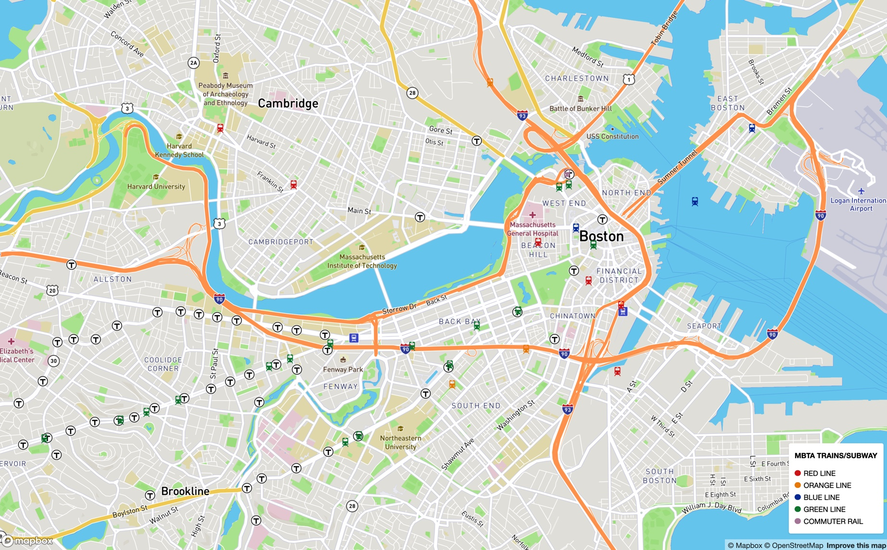
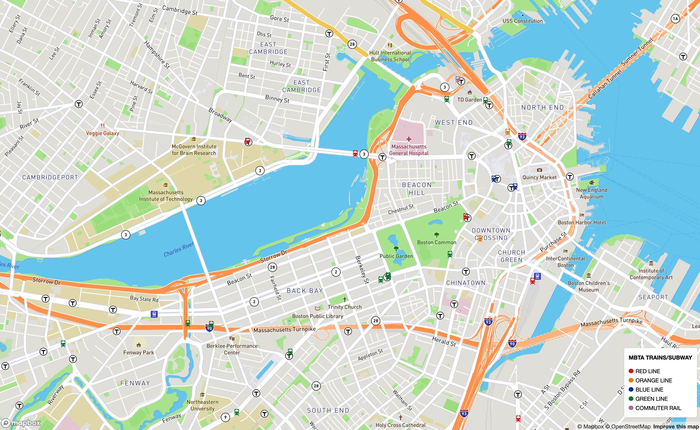

# train-tracker

<!-- PROJECT LOGO --> 
<br />
<p align="center">
  <a href="https://thewalkingduff.github.io/train-tracker/">
    
  </a>

  <h3 align="center">Boston Train Tracker</h3>

  <p align="center">
    An app that tracks on the subway and commuter trains in the Boston area.
    <br />
    <a href="https://thewalkingduff.github.io/train-tracker/"><strong>Explore the docs »</strong></a>
    <br />
    <br />
    <a href="https://thewalkingduff.github.io/train-tracker/">View Demo</a>
    ·
    <a href="https://thewalkingduff.github.io/train-tracker/">Report Bug</a>
    ·
    <a href="https://thewalkingduff.github.io/train-tracker/">Request Feature</a>
  </p>
</p>

<!-- TABLE OF CONTENTS -->
<details open="open">
  <summary><h2 style="display: inline-block">Table of Contents</h2></summary>
  <ol>
    <li>
      <a href="#about-the-project">About The Project</a>
      <ul>
        <li><a href="#built-with">Built With</a></li>
      </ul>
    </li>
    <li>
      <a href="#getting-started">Getting Started</a>
      <ul>
        <li><a href="#prerequisites">Prerequisites</a></li>
        <li><a href="#installation">Installation</a></li>
      </ul>
    </li>
    <li><a href="#usage">Usage</a></li>
    <li><a href="#roadmap">Roadmap</a></li>
    <li><a href="#contributing">Contributing</a></li>
    <li><a href="#license">License</a></li>
    <li><a href="#contact">Contact</a></li>
    <li><a href="#acknowledgements">Acknowledgements</a></li>
  </ol>
</details>

<!-- ABOUT THE PROJECT -->

## About The Project



(https://thewalkingduff.github.io/train-tracker/)

An app that use the MBTA API to track the subway and commuter trains in the Boston area.

`thewalkingduff`, `train-tracker`, `@duffManCode`, `bduffy@devduffy.com`, `Boston Train Tracker`

### Built With

- [MBTA API]()
- [HTML]()
- [CSS]()
- [JAVASCRIPT]()


<!-- GETTING STARTED -->

## Getting Started

To get a local copy up and running follow these simple steps.

### Prerequisites

This is an example of how to list things you need to use the software and how to install them.

- npm
  ```sh
  npm install npm@latest -g
  ```

### Installation

1. Clone the repo
   ```sh
   git clone https://thewalkingduff.github.io/train-tracker/.git
   ```
2. Install NPM packages
   ```sh
   npm install
   ```

<!-- USAGE EXAMPLES -->

## Usage

You can change the zoom of the map with your mouse.  If you click on the train it will tell you what train line it is, whether it is stopped or moving and sometimes even the speed! 

_For more examples, please refer to the [Documentation](https://example.com)_

<!-- ROADMAP -->

## Roadmap

I plan on adding a way to search by train or train stop and possibly finding out what train stop is next by clicking on the train.

<!-- CONTRIBUTING -->

## Contributing

Contributions are what make the open source community such an amazing place to be learn, inspire, and create. Any contributions you make are **greatly appreciated**.

1. Fork the Project
2. Create your Feature Branch (`git checkout -b feature/AmazingFeature`)
3. Commit your Changes (`git commit -m 'Add some AmazingFeature'`)
4. Push to the Branch (`git push origin feature/AmazingFeature`)
5. Open a Pull Request

<!-- LICENSE -->

## License

Distributed under the MIT License. See `LICENSE` for more information.

<!-- CONTACT -->

## Contact

Brendan Duffy - [@duffManCode](https://twitter.com/twitter_handle) - bduffy@devduffy.com

Project Link: [https://thewalkingduff.github.io/train-tracker/](https://thewalkingduff.github.io/train-tracker/)

<!-- ACKNOWLEDGEMENTS -->

## Acknowledgements

- [@locphamthanh at Canva (Subway graphic/icon)](https://www.canva.com/p/locphamthanh/)

<!-- MARKDOWN LINKS & IMAGES -->
<!-- https://www.markdownguide.org/basic-syntax/#reference-style-links -->

[contributors-shield]: https://img.shields.io/github/contributors/github_username/repo.svg?style=for-the-badge
[contributors-url]: https://github.com/github_username/repo/graphs/contributors
[forks-shield]: https://img.shields.io/github/forks/github_username/repo.svg?style=for-the-badge
[forks-url]: https://github.com/github_username/repo/network/members
[stars-shield]: https://img.shields.io/github/stars/github_username/repo.svg?style=for-the-badge
[stars-url]: https://github.com/github_username/repo/stargazers
[issues-shield]: https://img.shields.io/github/issues/github_username/repo.svg?style=for-the-badge
[issues-url]: https://github.com/github_username/repo/issues
[license-shield]: https://img.shields.io/github/license/github_username/repo.svg?style=for-the-badge
[license-url]: https://github.com/github_username/repo/blob/master/LICENSE.txt
[linkedin-shield]: https://img.shields.io/badge/-LinkedIn-black.svg?style=for-the-badge&logo=linkedin&colorB=555
[linkedin-url]: https://linkedin.com/in/github_username
